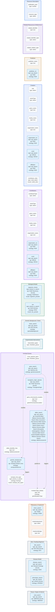

# FDF schema diagram

Auto-generated from `fdf_schema.json` by `tools/generate_diagram.py`. Do not edit by hand — regenerate instead.

```mermaid
flowchart TB
    classDef apiField fill:#e0f2fe,stroke:#0369a1,stroke-width:1px;
    classDef plainField fill:#f8fafc,stroke:#94a3b8,stroke-width:1px;
    subgraph sec_title["Resource Description"]
        direction TB
        f_title_publication_year("publication_year<br/>type: number"):::plainField
        f_title_resource_type("resource_type<br/>type: select"):::plainField
        style sec_title fill:#1f6feb1a,stroke:#1f6feb,stroke-width:2px
    end
    subgraph sec_related_identifiers["Related Resources & References"]
        direction TB
        f_related_identifiers_related_identifier("related_identifier<br/>type: text"):::plainField
        f_related_identifiers_related_identifier_type("related_identifier_type<br/>type: select"):::plainField
        f_related_identifiers_related_relation_type("related_relation_type<br/>type: select"):::plainField
        style sec_related_identifiers fill:#6f42c11a,stroke:#6f42c1,stroke-width:2px
    end
    subgraph sec_publisher["Publisher"]
        direction TB
        f_publisher_publisher_name("publisher_name<br/>type: text"):::plainField
        f_publisher_publisher_ror("publisher_ror<br/>type: api_search<br/>api: ROR<br/>ontology: ROR"):::apiField
        style sec_publisher fill:#b7791f1a,stroke:#b7791f,stroke-width:2px
    end
    subgraph sec_creators["Creators"]
        direction TB
        f_creators_role("role<br/>type: select"):::plainField
        f_creators_nameType("nameType<br/>type: select"):::plainField
        f_creators_given_name("given_name<br/>type: text"):::plainField
        f_creators_family_name("family_name<br/>type: text"):::plainField
        f_creators_organization_name("organization_name<br/>type: text"):::plainField
        f_creators_organization_ror("organization_ror<br/>type: api_search<br/>api: ROR<br/>ontology: ROR"):::apiField
        f_creators_orcid("orcid<br/>type: api_search<br/>api: ORCID<br/>ontology: ORCID"):::apiField
        f_creators_affiliation("affiliation<br/>type: api_search<br/>api: ROR<br/>ontology: ROR"):::apiField
        f_creators_contributor_roles("contributor_roles<br/>type: multi_select<br/>vocab: credit_roles"):::plainField
        style sec_creators fill:#2563eb1a,stroke:#2563eb,stroke-width:2px
    end
    subgraph sec_contributors["Contributors"]
        direction TB
        f_contributors_contributorType("contributorType<br/>type: select"):::plainField
        f_contributors_nameType("nameType<br/>type: select"):::plainField
        f_contributors_given_name("given_name<br/>type: text"):::plainField
        f_contributors_family_name("family_name<br/>type: text"):::plainField
        f_contributors_organization_name("organization_name<br/>type: text"):::plainField
        f_contributors_organization_ror("organization_ror<br/>type: api_search<br/>api: ROR<br/>ontology: ROR"):::apiField
        f_contributors_orcid("orcid<br/>type: api_search<br/>api: ORCID<br/>ontology: ORCID"):::apiField
        f_contributors_affiliation("affiliation<br/>type: api_search<br/>api: ROR<br/>ontology: ROR"):::apiField
        style sec_contributors fill:#7c3aed1a,stroke:#7c3aed,stroke-width:2px
    end
    subgraph sec_organism["Biological Model"]
        direction TB
        f_organism_organism_choice("organism_choice<br/>type: preset_or_search<br/>api: NCBI Taxonomy (OLS4)<br/>ontology: NCBITaxon<br/>vocab: organism_presets"):::apiField
        f_organism_sex("sex<br/>type: preset_or_search<br/>api: PATO (OLS4)<br/>ontology: PATO<br/>vocab: sex_presets"):::apiField
        style sec_organism fill:#2f855a1a,stroke:#2f855a,stroke-width:2px
    end
    subgraph sec_strain["Genetic Background / Strain"]
        direction TB
        f_strain_strain_search("strain_search<br/>type: api_search<br/>api: EFO (OLS4)<br/>ontology: speciesBackground"):::apiField
        style sec_strain fill:#7180961a,stroke:#718096,stroke-width:2px
    end
    subgraph sec_interventions["Experimental Interventions"]
        direction TB
        f_interventions_intervention_types("intervention_types<br/>type: checkbox_group"):::plainField
        style sec_interventions fill:#0e74901a,stroke:#0e7490,stroke-width:2px
    end
    subgraph sec_genes["Involved Genes"]
        direction TB
        f_genes_cross_species_gene("cross_species_gene<br/>type: checkbox_group"):::plainField
        f_genes_gene_search("gene_search<br/>type: api_search<br/>api: MyGene.info<br/>ontology: geneAccessionId"):::apiField
        f_genes_transgene_origin_species("transgene_origin_species<br/>type: api_search<br/>api: NCBI Taxonomy (OLS4)<br/>ontology: TransgeneOrigin"):::apiField
        f_genes_gene_chromosome_location("gene_chromosome_location<br/>type: text<br/>ontology: geneChromosomeLocation"):::plainField
        f_genes_allele_search("allele_search<br/>type: api_search<br/>api: Ensembl Allele / Alliance Genome Allele Search (Mus musculus) / Rat Genome Allele Search / Alliance Genome Allele Search (Danio rerio) / Alliance Genome Allele Search (Drosophila melanogaster) / Alliance Genome Allele Search (Caenorhabditis elegans) / Alliance Genome Variant Search<br/>ontology: alleleAccessionId"):::apiField
        f_genes_allele_identifier_free("allele_identifier_free<br/>type: text<br/>ontology: alleleAccessionId"):::plainField
        f_genes_genetic_background("genetic_background<br/>type: api_search<br/>api: Xenbase Mutant Lines<br/>ontology: xenopusStrainLine"):::apiField
        f_genes_xenopus_line_type("xenopus_line_type<br/>type: preset_or_search<br/>ontology: lineType<br/>vocab: xenbase_line_types"):::plainField
        f_genes_mutationType_display("mutationType_display<br/>type: text<br/>ontology: geneMutationType"):::plainField
        style sec_genes fill:#7c3aed1a,stroke:#7c3aed,stroke-width:2px
    end
    subgraph sec_chemicals["Molecules & Treatments"]
        direction TB
        f_chemicals_chem_search("chem_search<br/>type: api_search<br/>api: ChEBI<br/>ontology: ChEBI"):::apiField
        f_chemicals_treatmentprotocol("treatmentprotocol<br/>type: select"):::plainField
        f_chemicals_treatmentdesign("treatmentdesign<br/>type: text"):::plainField
        style sec_chemicals fill:#dd6b201a,stroke:#dd6b20,stroke-width:2px
    end
    subgraph sec_diet["Diet / Feeding Regiment"]
        direction TB
        f_diet_diet_search("diet_search<br/>type: api_search<br/>api: EFO Diet (OLS4)<br/>ontology: EFO"):::apiField
        style sec_diet fill:#64748b1a,stroke:#64748b,stroke-width:2px
    end
    subgraph sec_disease["Disease Model"]
        direction TB
        f_disease_disease_search("disease_search<br/>type: api_search<br/>api: Disease Ontology (OLS4)<br/>ontology: DOID"):::apiField
        f_disease_phenotype_search("phenotype_search<br/>type: api_search<br/>api: uPheno (OLS4)<br/>ontology: UPHENO"):::apiField
        style sec_disease fill:#64748b1a,stroke:#64748b,stroke-width:2px
    end
    subgraph sec_anatomy["Tissue / Organ of Interest"]
        direction TB
        f_anatomy_anat_search("anat_search<br/>type: api_search<br/>api: UBERON (OLS4)<br/>ontology: UBERON"):::apiField
        style sec_anatomy fill:#64748b1a,stroke:#64748b,stroke-width:2px
    end
    f_title_publication_year ~~~ f_title_resource_type
    f_title_resource_type ~~~ f_related_identifiers_related_identifier
    f_related_identifiers_related_identifier ~~~ f_related_identifiers_related_identifier_type
    f_related_identifiers_related_identifier_type ~~~ f_related_identifiers_related_relation_type
    f_related_identifiers_related_relation_type ~~~ f_publisher_publisher_name
    f_publisher_publisher_name ~~~ f_publisher_publisher_ror
    f_publisher_publisher_ror ~~~ f_creators_role
    f_creators_role ~~~ f_creators_nameType
    f_creators_nameType ~~~ f_creators_given_name
    f_creators_given_name ~~~ f_creators_family_name
    f_creators_family_name ~~~ f_creators_organization_name
    f_creators_organization_name ~~~ f_creators_organization_ror
    f_creators_organization_ror ~~~ f_creators_orcid
    f_creators_orcid ~~~ f_creators_affiliation
    f_creators_affiliation ~~~ f_creators_contributor_roles
    f_creators_contributor_roles ~~~ f_contributors_contributorType
    f_contributors_contributorType ~~~ f_contributors_nameType
    f_contributors_nameType ~~~ f_contributors_given_name
    f_contributors_given_name ~~~ f_contributors_family_name
    f_contributors_family_name ~~~ f_contributors_organization_name
    f_contributors_organization_name ~~~ f_contributors_organization_ror
    f_contributors_organization_ror ~~~ f_contributors_orcid
    f_contributors_orcid ~~~ f_contributors_affiliation
    f_contributors_affiliation ~~~ f_organism_organism_choice
    f_organism_organism_choice ~~~ f_organism_sex
    f_organism_sex ~~~ f_strain_strain_search
    f_strain_strain_search ~~~ f_interventions_intervention_types
    f_interventions_intervention_types ~~~ f_genes_cross_species_gene
    f_genes_cross_species_gene ~~~ f_genes_gene_search
    f_genes_gene_search ~~~ f_genes_transgene_origin_species
    f_genes_transgene_origin_species ~~~ f_genes_gene_chromosome_location
    f_genes_gene_chromosome_location ~~~ f_genes_allele_search
    f_genes_allele_search ~~~ f_genes_allele_identifier_free
    f_genes_allele_identifier_free ~~~ f_genes_genetic_background
    f_genes_genetic_background ~~~ f_genes_xenopus_line_type
    f_genes_xenopus_line_type ~~~ f_genes_mutationType_display
    f_genes_mutationType_display ~~~ f_chemicals_chem_search
    f_chemicals_chem_search ~~~ f_chemicals_treatmentprotocol
    f_chemicals_treatmentprotocol ~~~ f_chemicals_treatmentdesign
    f_chemicals_treatmentdesign ~~~ f_diet_diet_search
    f_diet_diet_search ~~~ f_disease_disease_search
    f_disease_disease_search ~~~ f_disease_phenotype_search
    f_disease_phenotype_search ~~~ f_anatomy_anat_search
    f_genes_gene_search -.->|enables| f_genes_allele_search
    f_genes_allele_search -.->|pushes to| f_genes_mutationType_display
    f_genes_gene_search -.->|enables| f_genes_genetic_background
    f_genes_genetic_background -.->|triggers| f_genes_xenopus_line_type
    f_genes_allele_search -.->|triggers| f_genes_mutationType_display
```
